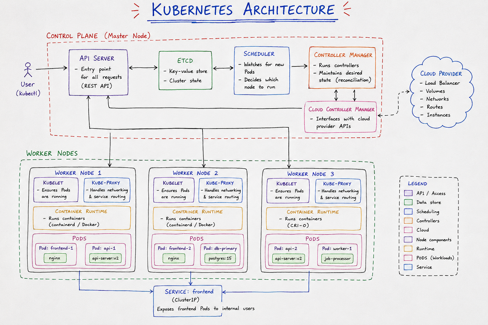

☸️ Kubernetes Architecture

Kubernetes architecture is mainly divided into Control Plane and Worker Nodes.

Control Plane → Manages and controls the Kubernetes cluster.
Worker Nodes → Run the application workloads in the form of Pods.
🧠 Control Plane Components
🔹 API Server

Definition: The API Server is the main entry point for communication with the Kubernetes cluster.

Example: When you run kubectl get pods, the request goes to the API Server.

🔹 etcd

Definition: etcd is a distributed key-value store that stores the Kubernetes cluster state.

Example: Information about Pods, Nodes, Services, and other Kubernetes objects is stored in etcd.

🔹 Scheduler

Definition: The Scheduler decides which Worker Node should run a newly created Pod.

Example: If Node 1 is busy and Node 2 has enough resources, the Scheduler may assign the Pod to Node 2.

🔹 Controller Manager

Definition: The Controller Manager runs controllers that continuously work to maintain the desired state of the cluster.

Example: If you want 3 Pods but one fails, a controller works to create a replacement.

🔹 Cloud Controller Manager (CCM)

Definition: The Cloud Controller Manager allows Kubernetes to interact with cloud-provider resources.

Example: It can help Kubernetes work with cloud load balancers or cloud nodes.

💪 Worker Node Components
🔹 Kubelet

Definition: Kubelet is an agent running on each Worker Node that makes sure the assigned Pods are running properly.

Example: If the Control Plane assigns a Pod to Node 1, the kubelet on Node 1 makes sure that Pod is running.

🔹 Kube-proxy

Definition: Kube-proxy helps implement Kubernetes Service networking and route network traffic toward the appropriate Pods.

Example: Traffic sent to a Service can be directed to one of the Pods behind that Service.

🔹 Container Runtime

Definition: The Container Runtime is responsible for running containers on the Worker Node.

Examples: containerd, CRI-O

🔹 Pod

Definition: A Pod is the smallest deployable unit in Kubernetes and contains one or more containers.

Example:

Pod
 └── Nginx Container

 